# Analisa Tren dan Pola Belanja di Istanbul Tahun 2021-2022

Tool : Jupyter Notebook  
Programming Language : Python  
Visualization : Matplotlib, Seaborn, Looker Data Studio [Dashboard - Lihat Disini](https://lookerstudio.google.com/s/sc9f69chkRo)  
Dataset : [Lihat Disini](https://www.kaggle.com/datasets/mehmettahiraslan/customer-shopping-dataset/data)

---

## Introduction
Project ini merupakan final project dari program pelatihan PROA yang diselenggarakan oleh Digitalent KOMINFO bekerjasama dengan Cisco sebagai bentuk pengaplikasian bahasa pemrograman Python di dalam Big Data. Pada project ini saya berperan sebagai Data Analyst yang melakukan analisa tren dan pola belanja di Istanbul.

## Objective
Membuat visualisasi berbasis data sebagai insight melalui hal-hal berikut :
1. Demografi customer
2. Category product yang sering dibeli customer
3. Perilaku belanja customer berdasarkan pemilihan metode pembayaran dan category usia 
4. Mall apa yang menjadi favorit untuk berbelanja
5. Tren transaksi berdasarkan hari, bulan, dan tahun
   
---

## Overview
Dataset terdiri dari 99457 baris dan 10 kolom.

   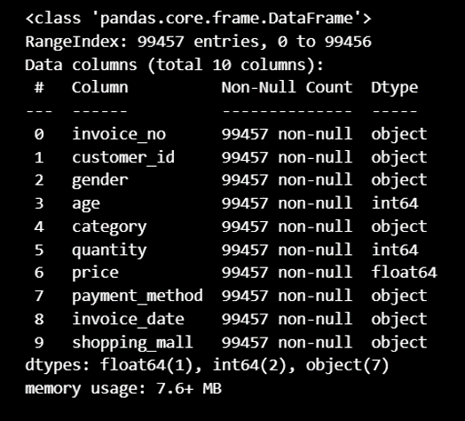

## Data Cleaning
1. Tidak ditemukan data kosong.
2. Tidak ditemukan data duplikat.
   
## Data Preprocessing
### Feature Engineering
1. Membuat feature baru yaitu `total_payment`
2. Mengurai kolom `invoice_date` menjadi hari, bulan, dan tahun.
3. Membuat feature baru yaitu `age_category`.

### Merubah Tipe Data
1. `invoice_date` menjadi datetime
2. `month` menjadi object
3. `year` menjadi object

### Menghapus Data yang Tidak Diperlukan
Feature yang tidak digunakan dan di drop adalah `customer_id`.

### Filter Data
Dataset yang diberikan adalah dari tahun 2021-2023, namun karena pada tahun 2023 data tidak lengkap (hanya sampai bulan Maret), maka diputuskan untuk menggunakan data tahun 2021-2022.

---

## Analysis
### 1. Demografi Customer

   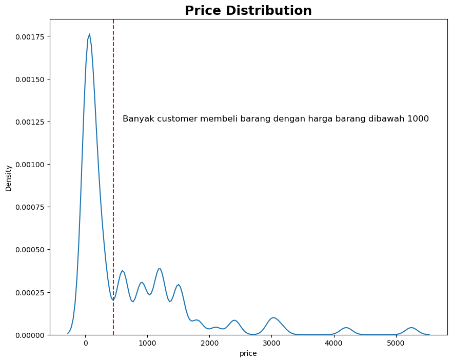 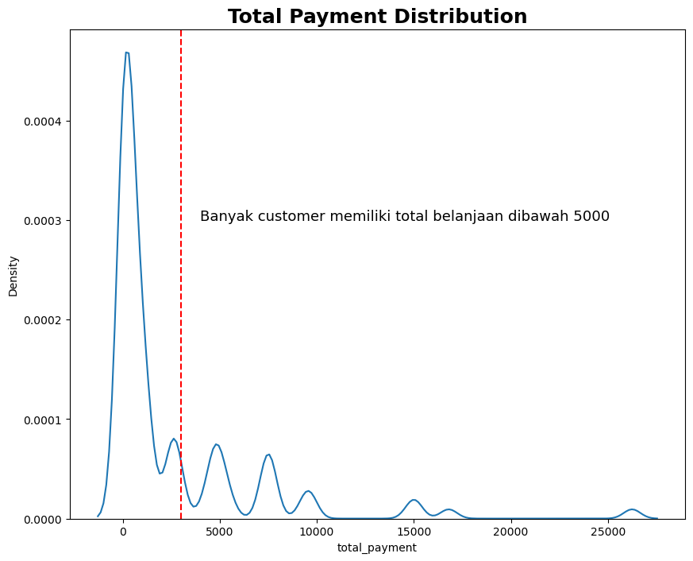

   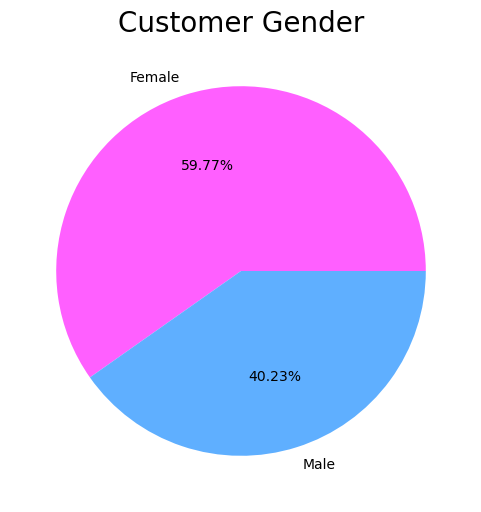 

   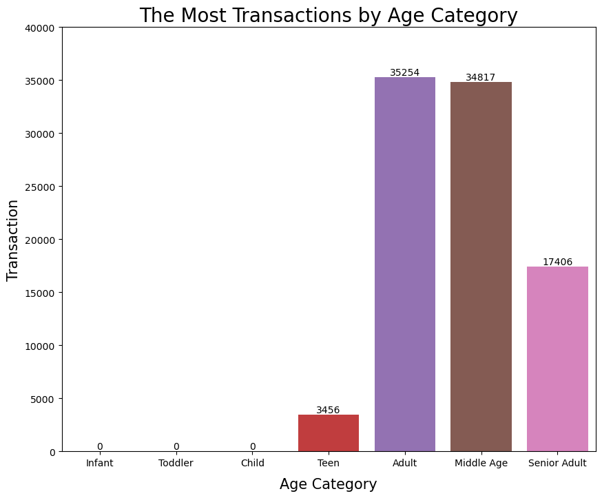 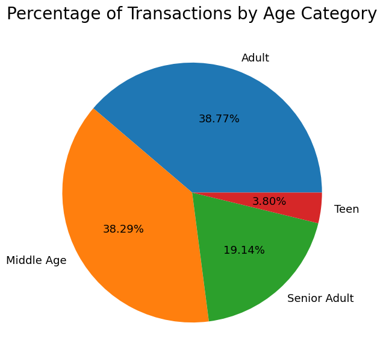

   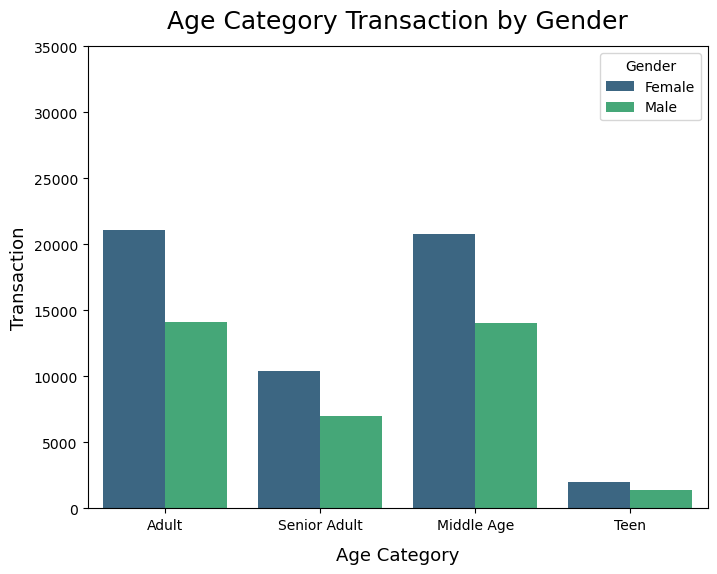 

Mayoritas customer membeli barang dibawah harga 1000 lira dan total belanja dibawah 5000 lira. Customer yang melakukan transaksi di Mall didominasi oleh **Wanita** (59.77%) yang memiliki kategori usia **Adult dan Middle Age**.

### 2. Category Product Favorit 

   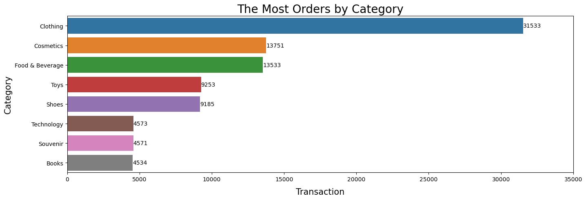   

    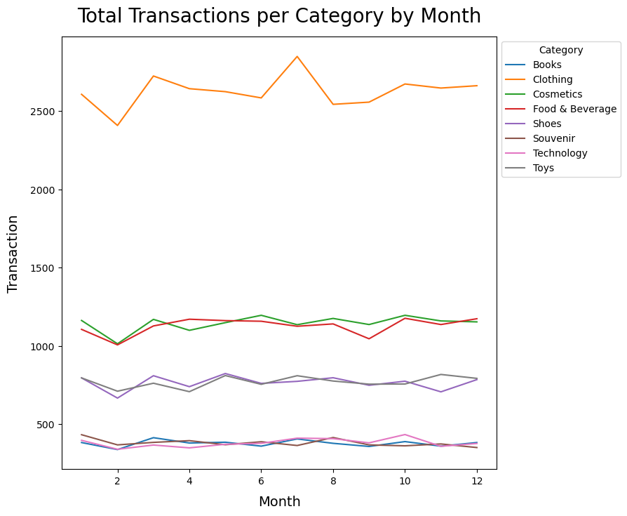  

Kategori produk yang paling banyak dibeli disetiap bulannya adalah **pakaian**, namun total belanja (spending money) yang dilakukan oleh customer paling tinggi di kategori **teknologi**. Hal ini dikarenakan harga teknologi relatif lebih mahal dibandingkan dengan kategori lainnya. Untuk kategori pakaian paling banyak dibeli pada bulan Juli dan paling rendah pada bulan Februari. Hal ini mungkin dikarenakan faktor musim, dimana pada bulan Februari merupakan puncak musim dingin sehingga orang akan cenderung di dalam rumah, sedangkan pada bulan Juli merupakan puncak musim panas dimana mungkin orang berbelanja pakaian untuk mempersiapkan musim dingin (referensi : [baca disini](https://thefoxmagazine.com/fashion/why-its-better-to-buy-winter-clothes-in-the-summer-and-how-to-benefit-from-it/)). 

   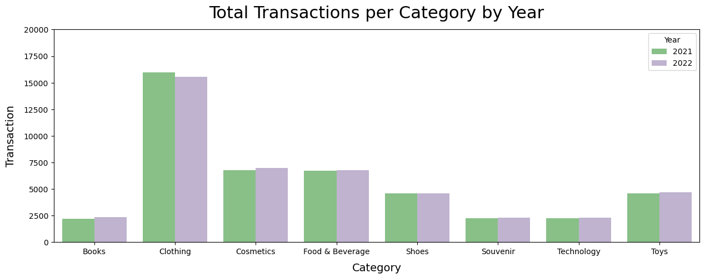  

Dari semua kategori yang ada, kategori yang mengalami penurunan transaksi yang cukup banyak dari tahun 2021 ke 2022 adalah pakaian. Untuk kategori lainnya mengalami peningkatan transaksi, kecuali kategori sepatu yang relatif tetap. 

### 3. Perilaku Customer Berdasarkan Metode Pembayaran dan Kategori Usia

   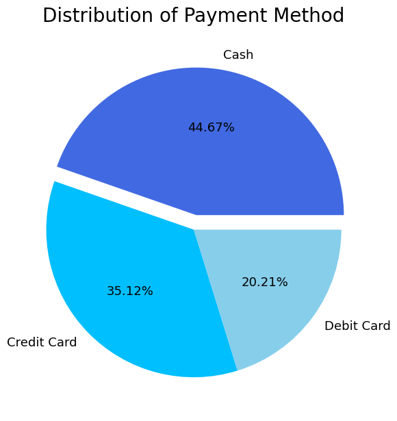  

   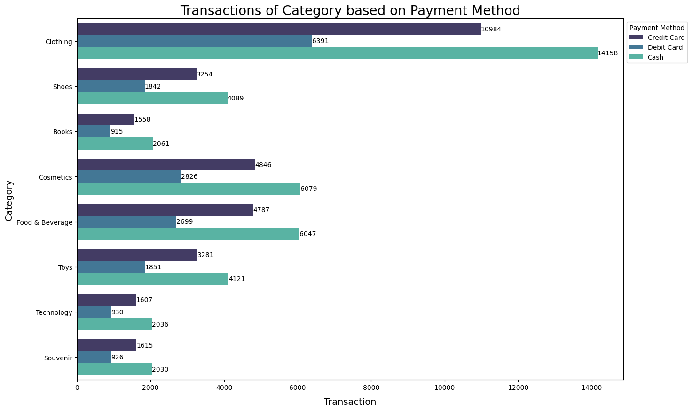 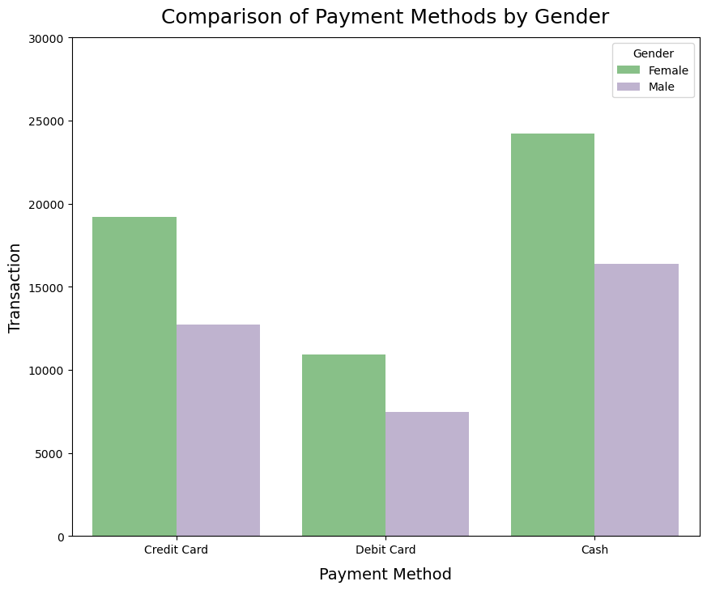  

 

Metode pembayaran yang paling sering digunakan adalah **Cash**, yaitu sebanyak 44.67%. Pembayaran transaksi dengan kategori produk apapun lebih banyak menggunakan cash.

      

Semua kategori usia memilih melakukan pembayaran dengan cash.

  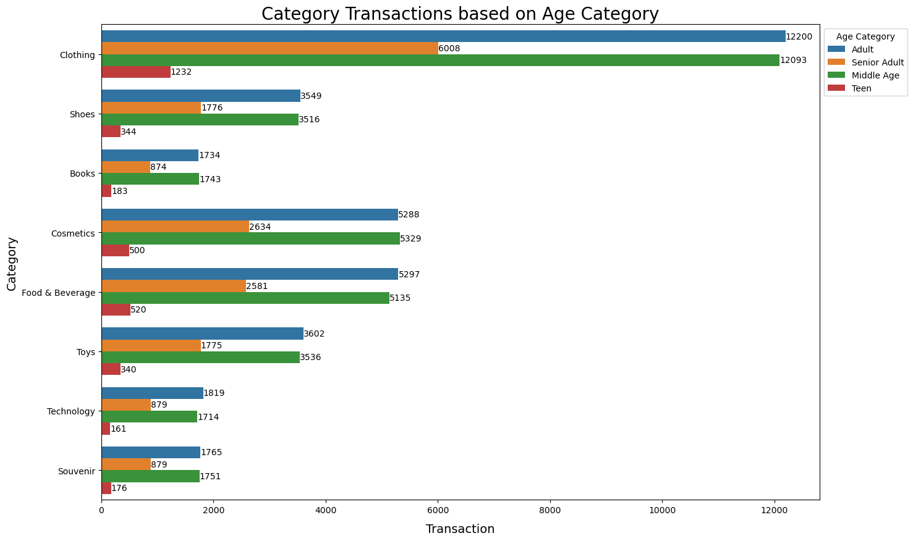 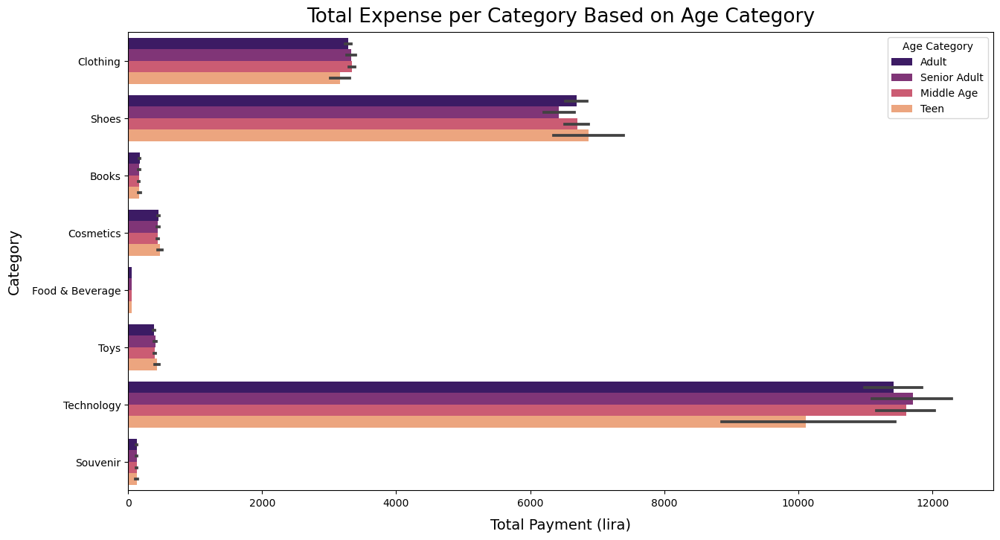   

Transaksi di setiap kategori didominasi oleh usia Adult dan Middle Age. Namun hanya pada kategori kosmetik, usia Middle Age lebih banyak melakukan transaksi daripada Adult. Kategori usia Senior Adult memiliki total expense atau total belanjaan (spending money) terbanyak untuk kategory teknologi, usia Middle Age pada kategory pakaian, usia Teen pada kategori sepatu, kosmetik, dan mainan.

### 4. Mall Favorit Untuk Berbelanja

   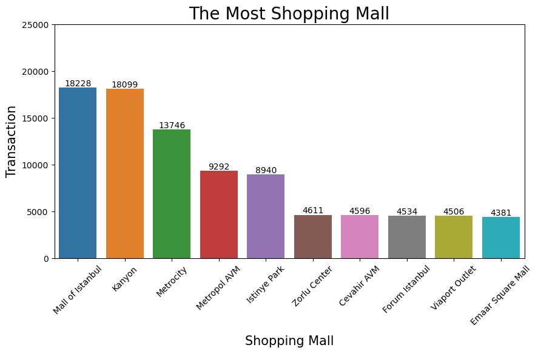
   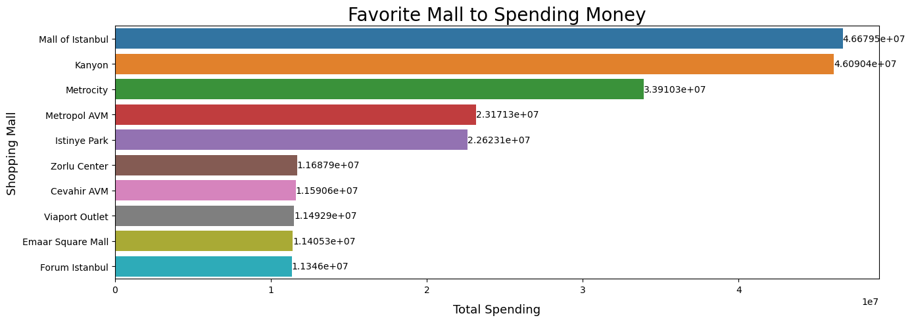

Di antara 10 mall, transaksi paling banyak terjadi di Mall of Istanbul yaitu dengan transaksi sebanyak 18228 atau dengan kata lain Mall of Istanbul menyumbang 20,05% dari semua transaksi pada 2021-2022. Selain transaksi paling banyak, Mall of Istanbul juga mendapatkan income yang paling banyak dibandingkan dengan mall yang lain.

### 5. Tren Transaksi Belanja

   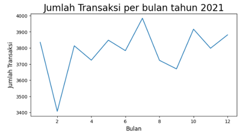 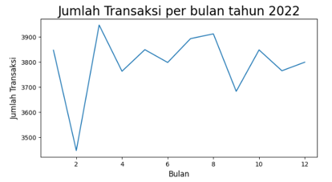

   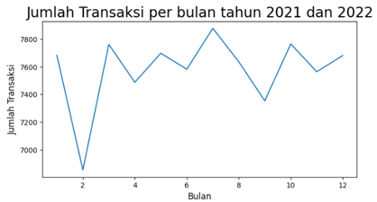

Pada tahun 2021 dan 2022, setiap bulan Februari dan bulan September terjadi penurunan transaksi. Hal ini mungkin berkaitan dengan musim yang ada di Istanbul, dimana pada bulan Februari terjadi puncak musim dingin dan bulan September akhir musim panas.

   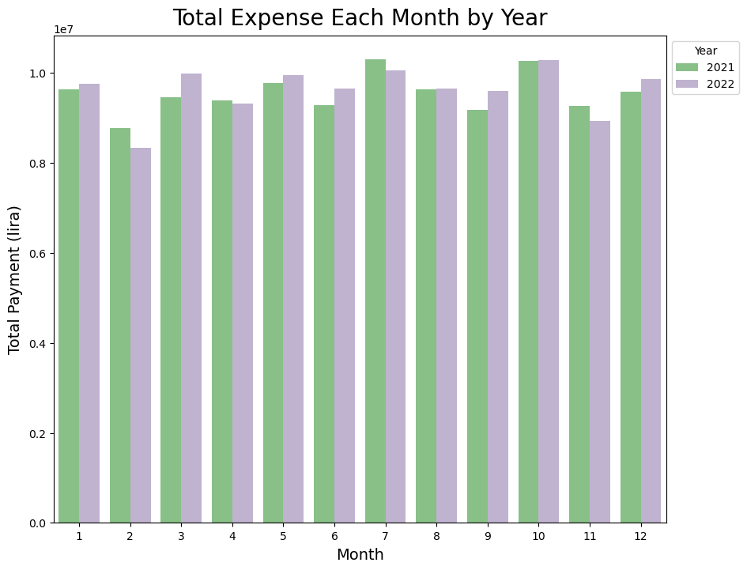

Pada bulan Januari, Maret, Mei, Juni, Agustus, September, Oktober, dan Desember terjadi peningkatan total belanja (money expense). Sedangkan pada bulan Februari, April, dan November terjadi penurunan.

   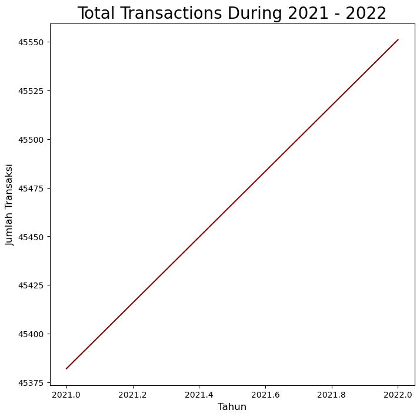

Secara keseluruhan, transaksi dari tahun 2021 ke 2022 terjadi peningkatan.

---

## Kesimpulan
1. Transaksi dan total pembelanjaan didominasi oleh jenis kelamin perempuan.
2. Kategori yang paling diminati atau dibeli adalah pakaian sedangkan yang kurang diminati adalah buku, souvenir dan teknologi.
3. Usia yang paling banyak melakukan transaksi adalah usia yang produktif yaitu pada category usia Adult hingga Middle Age.
4. Kategori usia Senior Adult memiliki total expense atau total belanjaan (spending money) terbanyak untuk kategory teknologi, usia Middle Age pada kategory pakaian, usia Teen pada kategori sepatu, kosmetik, dan mainan.
5. Transaksi dan total belanja terbanyak terjadi di Mall of Istanbul.
6. Metode pembayaran yang paling sering digunakan adalah cash. 
7. Dalam hal transaksi, category pakaian adalah yang paling tinggi dibandingkan dengan yang lainnya. Sedangkan dalam hal total belanjaan (spending money), technology adalah yang paling tinggi dibandingkan category yang lainnya. Hal ini dikarenakan harga dari technology relatif tinggi dibandingkan yang lainnya
8. Produk dengan harga murah, memiliki frekuensi transaksi yang lebih tinggi dibandingkan dengan produk yang harga nya mahal.
9. Pada tahun 2021 dan 2022, setiap bulan Februari dan bulan September terjadi penurunan transaksi yang cukup signifikan dengan catatan pada bulan Februari terjadi puncak musim dingin di Turki dan pada akhir September terjadi musim panas di Turki.

---

## Rekomendasi Bisnis

1. Pemberian fasilitas pelayanan pengiriman barang kepada usia Senior Adult, terutama untuk pembelian produk teknologi. Hal ini diperlukan sebagai bentuk reward karena sebagai customer dengan total expense tertinggi untuk kategori teknologi. Untuk meningkatkan transaksi pada kategori usia ini, terutama untuk meningkatkan total pembelanjaan di kategori sepatu, maka dapat diberikan diskon untuk customer dengan kategori usia Senior Adult.
2. Untuk meningkatkan transaksi bagi gender pria, maka dapat dilakukan promo atau penawaran khusus bagi gender pria, seperti : diadakannya “ManDay”, potongan harga (besaran diskon dengan analisa lebih lanjut) jika customernya adalah pria, free gift, dan lain-lain.
3. Untuk meningkatkan penjualan kategori produk yang kurang diminati, yaitu buku dan souvenir, bisa dengan strategi bundling atau variasi dari hal tersebut bisa lebih disesuaikan atau diperbanyak sesuai dengan kategori usia Adult dan Middle Age 
4. Bekerjasama dengan pihak perbankan untuk meningkatkan metode pembayaran dengan kartu kredit dan kartu debit. Sehingga selain meningkatkan metode pembayaran kartu kredit dan debit, juga dapat meningkatkan transaksi kategori produk. Misalnya : untuk pembelian kategori buku/souvenir/teknologi dengan minimal pembayaran tertentu mendapatkan cashback atau voucher.
5. Untuk meningkatkan transaksi pada bulan Februari (puncak musim dingin) dan bulan September (akhir musim panas), maka pihak mall dapat memberikan fasilitas pengiriman barang ke rumah customer untuk mengatasi customer yang ingin berbelanja tetapi malas keluar rumah karena faktor cuaca.

---

## Tampilan Dashboard

[Lihat Disini](https://lookerstudio.google.com/s/sc9f69chkRo)

   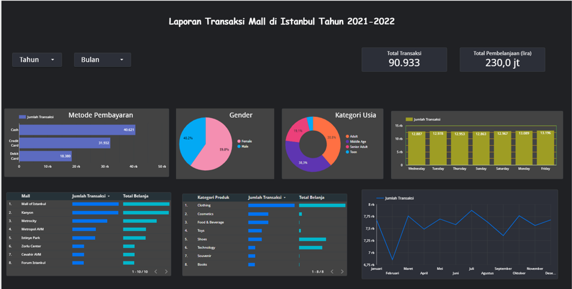

