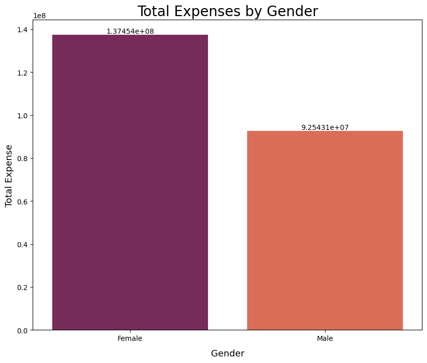

# Analisa Tren dan Pola Belanja di Istanbul Tahun 2021-2022

Tool : Jupyter Notebook  
Programming Language : Python  
Visualization : Matplotlib, Seaborn, Looker Data Studio  
Dataset : [Lihat Disini](https://www.kaggle.com/datasets/mehmettahiraslan/customer-shopping-dataset/data)

---

## Introduction
Project ini merupakan final project dari program pelatihan PROA yang diselenggarakan oleh Digitalent KOMINFO bekerjasama dengan Cisco sebagai bentuk pengaplikasian bahasa pemrograman Python di dalam Big Data. Pada project ini saya berperan sebagai Data Analyst yang melakukan analisa tren dan pola belanja di Istanbul.

## Objective
Membuat visualisasi berbasis data sebagai insight melalui hal-hal berikut :
1. Demografi customer
2. Category product yang sering dibeli customer
3. Perilaku belanja customer berdasarkan pemilihan metode pembayaran dan category usia 
4. Mall apa yang menjadi favorit untuk berbelanja
5. Tren transaksi berdasarkan hari, bulan, dan tahun
   
---

## Overview
Dataset terdiri dari 99457 baris dan 10 kolom.

   

## Data Cleaning
1. Tidak ditemukan data kosong.
2. Tidak ditemukan data duplikat.
   
## Data Preprocessing
### Feature Engineering
1. Membuat feature baru yaitu `total_payment`
2. Mengurai kolom `invoice_date` menjadi hari, bulan, dan tahun.
3. Membuat feature baru yaitu `age_category`.

### Merubah Tipe Data
1. `invoice_date` menjadi datetime
2. `month` menjadi object
3. `year` menjadi object

### Menghapus Data yang Tidak Diperlukan
Feature yang tidak digunakan dan di drop adalah `customer_id`.

### Filter Data
Dataset yang diberikan adalah dari tahun 2021-2023, namun karena pada tahun 2023 data tidak lengkap (hanya sampai bulan Maret), maka diputuskan untuk menggunakan data tahun 2021-2022.

---

## Analysis
### 1. Demografi Customer

    

    

    

    

Mayoritas customer membeli barang dibawah harga 1000 lira dan total belanja dibawah 5000 lira. Customer yang melakukan transaksi di Mall didominasi oleh **Wanita** (59.77%) yang memiliki kategori usia **Adult dan Middle Age**.

### 2. Category Product Favorit 

      

      

Kategori produk yang paling banyak dibeli disetiap bulannya adalah **pakaian**, namun total belanja (spending money) yang dilakukan oleh customer paling tinggi di kategori **teknologi**. Hal ini dikarenakan harga teknologi relatif lebih mahal dibandingkan dengan kategori lainnya. Untuk kategori pakaian paling banyak dibeli pada bulan Juli dan paling rendah pada bulan Februari. Hal ini mungkin dikarenakan faktor musim, dimana pada bulan Februari merupakan puncak musim dingin sehingga orang akan cenderung di dalam rumah, sedangkan pada bulan Juli merupakan puncak musim panas dimana mungkin orang berbelanja pakaian untuk mempersiapkan musim dingin (referensi : [baca disini](https://thefoxmagazine.com/fashion/why-its-better-to-buy-winter-clothes-in-the-summer-and-how-to-benefit-from-it/)). 

     

Dari semua kategori yang ada, kategori yang mengalami penurunan transaksi yang cukup banyak dari tahun 2021 ke 2022 adalah pakaian. Untuk kategori lainnya mengalami peningkatan transaksi, kecuali kategori sepatu yang relatif tetap. 

### 3. Perilaku Customer Berdasarkan Metode Pembayaran dan Kategori Usia

      

      

 

Metode pembayaran yang paling sering digunakan adalah **Cash**, yaitu sebanyak 44.67%. Pembayaran transaksi dengan kategori produk apapun lebih banyak menggunakan cash.

      

      

